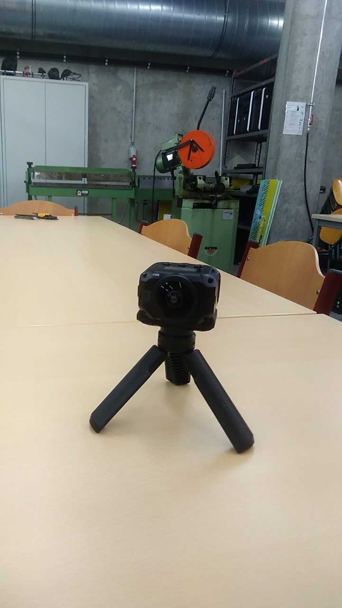
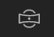
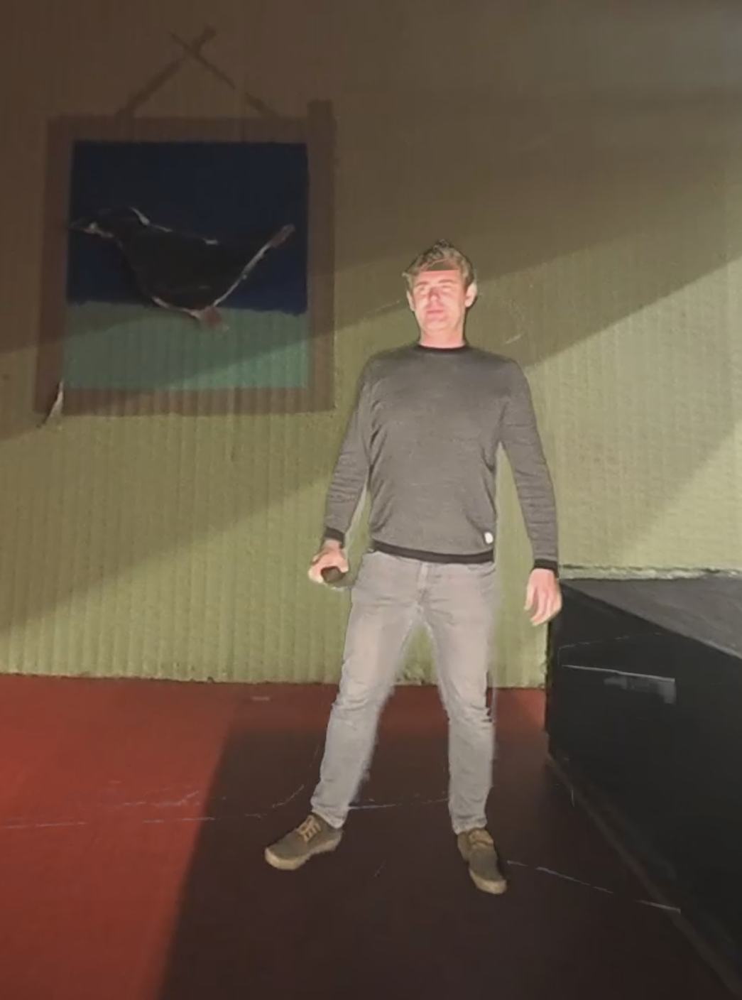

# Dive into my world

# Overview

Deze VR demo laat ons enkele mogelijkheden zien hoe je een 360° verhaal technisch kan opzetten.

Wat je gaat doen:
- Maak een 360 video van je eigen wereld
- Stap zelf in je eigen wereld door middel van de 360 green room
- Spring van de reële wereld in de virtuele wereld


# Maak een 360 video van je eigen wereld

## Garmin Virb Camera



## Opname

Neem de Garmin Virb camera, en plaats deze in de wereld:


  
Om een opname te starten installeer je de Garmin VIRB app op je smartphone, of je neemt de video als volgt op:
 
- Plaats de opnameschakelaar naar voren om de video-opname te starten.
- Als het toestel is uitgeschakeld, wordt het nu automatisch ingeschakeld. Het toestel begint direct met het maken van video-opnamen en het rode lampje gaat aan.
- Plaats de opnameschakelaar naar achteren om de video-opname te stoppen.
- De video wordt op de geheugenkaart opgeslagen als .mp4-bestand.  

## Bekijk de video

- Plaats het geheugenkaartje in de PC, en kopieer de video naar de HD
- Open GoPro VR player 
- drag & drop je video naar de GoPro VR Player en bekijk de video met de HTC VIVE VR Set.


# Stap zelf in je eigen wereld door middel van de 360 green room

- Maak een opname van jezelf in de green room
- Plaats het geheugenkaartje in de PC, en kopieer de video naar de HD
- open adobe premiere pro


- media browser	: hier zijn je bestanden (video's) opgelijst. Drag & drop je videobestand hierin.
- source pane	: hier worden je bestanden getoond die afgespeeld worden, en kan je effecten selecteren
- program pane	: Hier worden de sequencies van je clips afgespeeld
- timeline		: Hier verzamel je al je fragmenten


Door in de de program pane op de play knop te drukken speel je je video in Adobe Premiere Pro af.

 : Door op de VR toggle knop te klikken kan je de video in 360° bekijken.

Adobe Premiere Pro heeft enkele tools ter beschikking om je "green" uit je video te verwijderen. Te vinden in de effecten tab (onder video effects (media browser pane)). Er is zowel color key , als Ultra key. Ultra Key is degene die we gaan gebruiken.


### Stappenplan om de Ultra key te gebruiken:
	
	1. drag & drop de Ultra key op je video bestand van de timeline
	2. Gan naar de effects control tab (in de source pane)
	3. Gebruik de eyedropper tool om het groen te selecteren (test welk het beste resultaat geeft)
	4. Gebruik de setting optie om je effect eventueel te vergroten
	5. Speel met de matte Generation effecten tot je een degelijk resultaat krijgt.


TIP:

Je kan misschien een beter resultaat bekomen door slechts een deel van je 360° footage te gebruiken. Dit kan met behulp van een masker, en in dat masker dat je ultra key effect te gebruiken. Je kan zelfs meerdere maskers maken!

Hoe een "masker" maken:
https://helpx.adobe.com/premiere-pro/using/masking-tracking.html

(Via cropping tool => filter > video > transform > cropping . Daarna left eigenschap gebruiken)

Als je green key uit je footage is verwijderd dan drag en drop je je video van je wereld in de timeline (je green key video staat bovenaan), en test je de video in VR mode


Daarna exporteer je je video en bekijk je deze in de GoProVR player met de HTC Vive VR set.



# Spring van de reële wereld in de virtuele wereld

Stappenplan Unity:

- Verwijder de standaard camera
- Voeg SteamVR plugin toe (via asset store)
- Voeg via steamvr > core >Prefabs > Player toe aan je scene
- Maak een nieuw materiaal aan (rechtermuisknop scene > create material)
    * De settings zijn:
     - shader : skybox/Panaramic
- Maak een nieuw texture aan (de afmetingen (dimensions) zijn dezelfde als die van je opgenomen film)
- ga terug naar je material en sleep je texture erin
- Maak in je scene een video player aan, en voeg je video eraan toe + sleep je texture naar de video player
- Ga naar windows > rendering > lighting settings en het skybox materiaal moet nu je zelf gemaakte materiaal zijn.
- Speel je unity scene af.

## Input control

Als je de controller gebruikt, kan je na vb. een klik van video veranderen. Op die manier spring je van de reële wereld in de virtuele wereld :-).

- Voeg een nieuw empty game object toe in de scene
- voeg een nieuw "empty" script toe
- dubbel klik op het script en copy paste onderstaande code:

## Input Script

```
using System.Collections;
using System.Collections.Generic;
using UnityEngine;
using UnityEngine.Video;
using Valve.VR;
using Valve.VR.InteractionSystem;

public class changeVideo : MonoBehaviour
{
    public SteamVR_Action_Boolean steamVR_Action;
    public VideoPlayer video;

    public Hand hand;

  

    private void OnEnable()
    {
        if (hand == null)
            hand = this.GetComponent<Hand>();

        steamVR_Action.AddOnStateDownListener(Down, hand.handType);
    }

    private void Down(SteamVR_Action_Boolean fromAction, SteamVR_Input_Sources fromSource)
    {
        video.url = "C:\\Users\\eaict\\Desktop\\Secundair\\Test1\\Assets\\Scenes\\2.mp4";
        Debug.Log($"Clicked button");
    }
}


```

Daarna klik je op je empty object en stel je volgende settings in:

- Steam VR action: \actions\default\in\GrabPinch
- Video: je video player
- Hand : left hand o right hand van de player


