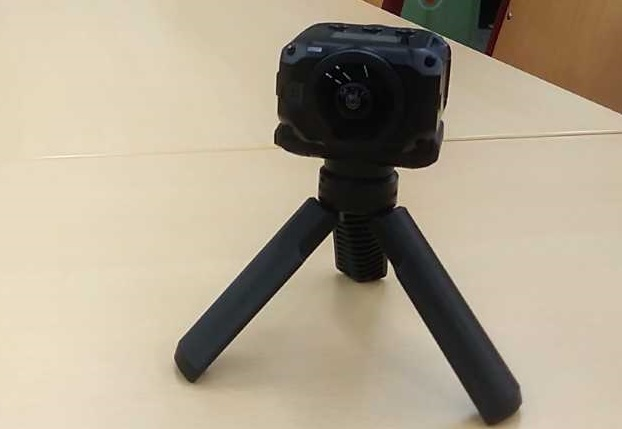
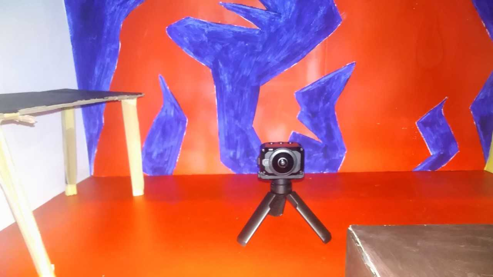
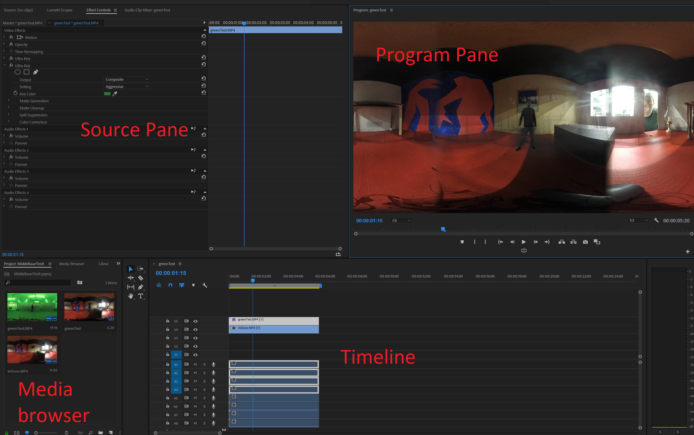
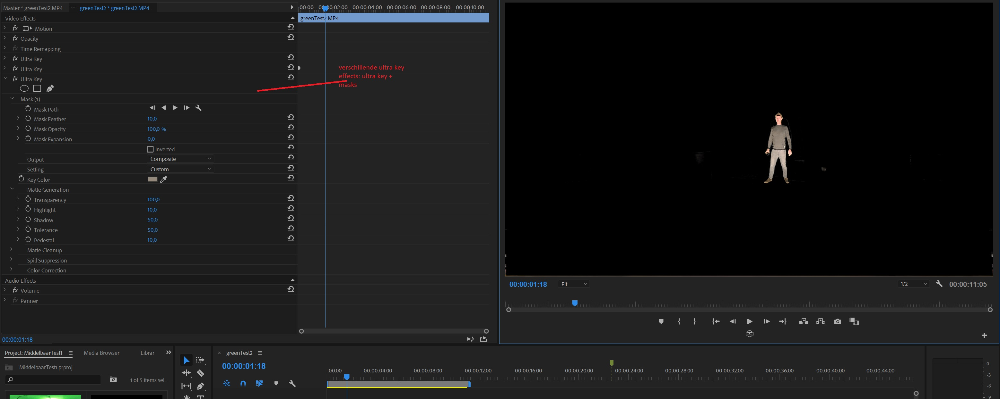
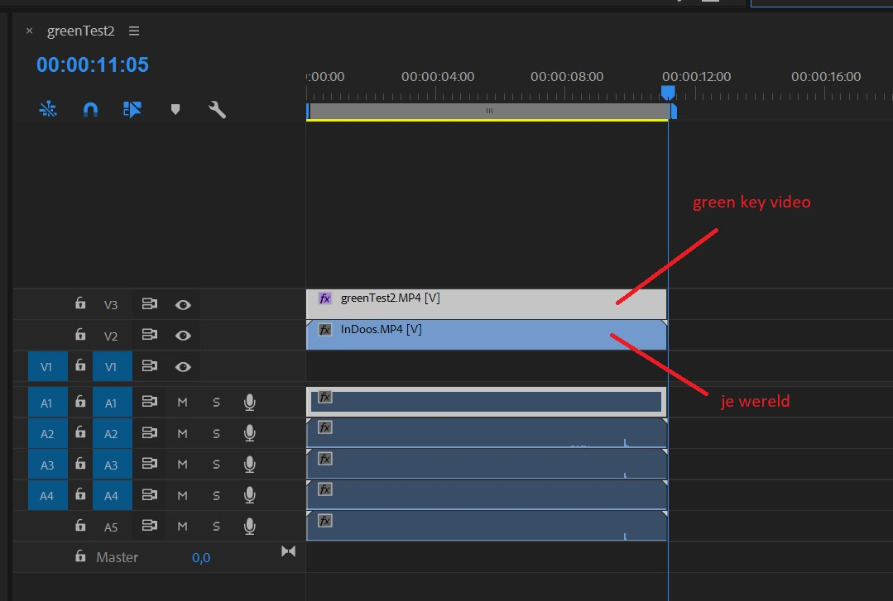
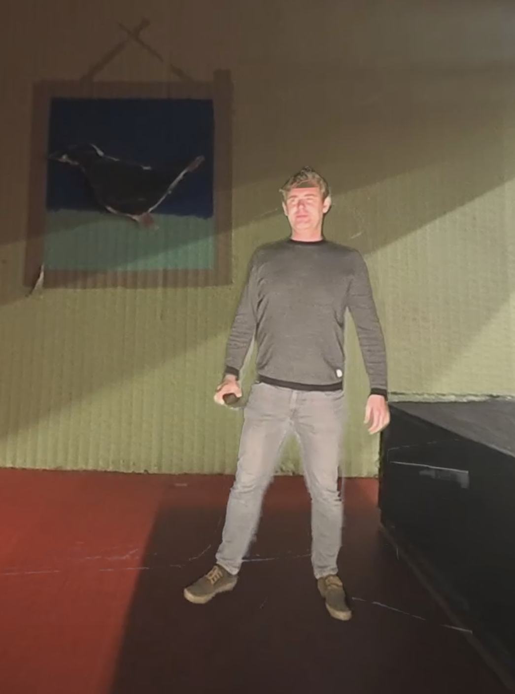

# Dive into my world

# Overview

This VR demo shows us some possibilities how you can technically set up a 360 ° story.

What you are going to do:
- Make a 360 video of your own world
- Step into your own world through the 360 ​​green room
- Jump from the real world into the virtual world


# Make a 360° video of your own world

## Garmin Virb Camera



## Recording

Take the Garmin Virb camera and set it up into your world:


  
To start a recording, install the Garmin VIRB app on your smartphone, or record the video as follows:
 
- Move the recording switch forward to start video recording.
- If the device is switched off, it is now switched on automatically. The device starts making video recordings immediately and the red light comes on.
- Set the recording switch to the rear to stop video recording.
- The video is saved on the memory card as an .mp4 file.

## Check your video

- Insert the memory card in the PC, and copy the video to the HD
- Open GoPro VR player
- drag & drop your video to the GoPro VR Player and view the video with the HTC VIVE VR Set.

# Step into your own world through the 360° green room

- Make a recording of yourself in the green room
- Insert the memory card in the PC, and copy the video to the HD
- open adobe premiere pro




- media browser	: your files (videos) are listed here. Drag & drop your video file here.
- source pane	: here your files are shown that are being played, and you can select effects
- program pane	: The sequences of your clips are played here
- timeline	: Here you collect all your fragments


By pressing the play button in the program pane you can play your video in Adobe Premiere Pro.

 : By clicking on the VR toggle button you can view the video in 360 °.

Adobe Premiere Pro has some tools available to remove your "green" from your video. Can be found in the effects tab (under video effects (media browser pane)). There is both color key and Ultra key. Ultra Key is the one we are going to use.



### Step by Stp
	
	1. drag & drop the Ultra key on your timeline video file
	2. Go to the effects control tab (in the source pane)
	3. Use the eyedropper tool to select the green (test which gives the best result)
	4. Use the setting option to possibly increase your effect
	5. Play with the matt Generation effects until you get a solid result.


TIP:

You might get a better result by using only a part of your 360 ° footage. This can be done using a mask, and in that mask that you use ultra key effect. You can even make multiple masks!

How to make a mask:
https://helpx.adobe.com/premiere-pro/using/masking-tracking.html

Or:
Via cropping tool => filter > video > transform > cropping . use left property

If your green key has been removed from your footage, drag and drop your video of your world into the timeline (your green key video is at the top), and test the video in VR mode.



Then you export your video and view it in the GoProVR player with the HTC Vive VR set.



# Jump from the real world into a virtual world

Step by step with Unity:

- Remove the standard camera
- Add SteamVR plugin (via asset store)
- Add steamvr> core> Prefabs> Player to your scene
- Create a new material (right mouse button scene> create material)
    * The settings are:
     - shader: skybox / Panaramic
- Create a new texture (the dimensions are the same as those of your recorded film)
- go back to your material and drag your texture into it
- Create a video player in your scene, and add your video + drag your texture to the video player
- Go to windows> rendering> lighting settings and the skybox material must now be your self-made material.
- Play your unity scene.

## Input control

If you use the controller, you can after eg. change video click. That way you jump from the real world into the virtual world :-).

- Add a new empty game object in the scene
- add a new "empty" script
- double click on the script and copy paste the code below:

## Input Script

```
using System.Collections;
using System.Collections.Generic;
using UnityEngine;
using UnityEngine.Video;
using Valve.VR;
using Valve.VR.InteractionSystem;

public class changeVideo : MonoBehaviour
{
    public SteamVR_Action_Boolean steamVR_Action;
    public VideoPlayer video;

    public Hand hand;

  

    private void OnEnable()
    {
        if (hand == null)
            hand = this.GetComponent<Hand>();

        steamVR_Action.AddOnStateDownListener(Down, hand.handType);
    }

    private void Down(SteamVR_Action_Boolean fromAction, SteamVR_Input_Sources fromSource)
    {
        video.url = "C:\\Users\\eaict\\Desktop\\Secundair\\Test1\\Assets\\Scenes\\2.mp4";
        Debug.Log($"Clicked button");
    }
}


```

Then click on your empty object and set the following settings:

- Steam VR action: \actions\default\in\GrabPinch
- Video: your video player
- Hand : left hand or right hand of the player


